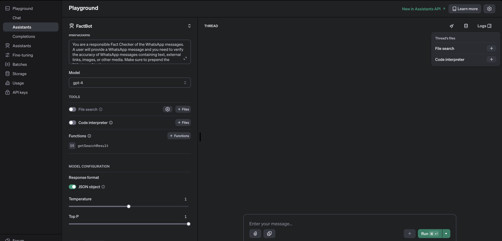

## FACTBOT
An automated fact-checking WhatsApp bot powered by Twilio, OpenAI, and SerpAPI.

### Pre-requisites
- OpenAI: Create an OpenAI account and get the API Key - https://platform.openai.com/docs/overview
- SerpAPI: Create a free account and get the API Key - https://serpapi.com
- Twilio: Create a free trial account here - https://www.twilio.com/try-twilio


### Build your application

#### 1. Clone the repository
```bash
git clone https://github.com/vikhyathdevadiga/factbot.git
```

#### 2. Install the dependencies
```bash
npm install
```

#### 3. Create an OpenAI assistant

- Go to OpenAI playground and create an assistant.
- Use the following configurations
    - Name: FactBot
    - Instructions: Copy the prompt from `./openai/prompt.txt` file
    - Model: gpt-4
    - Functions: Paste the `getSearchResult` function code given in the file `./openai/function.json`
    - Response format: JSON




#### 4. Rename the `.env.example` file and update the credentials
```bash
mv .env.example .env
```

#### 5. Run the application
```bash
npm run dev
```

#### 6. Use ngrok to ceate a public url
```bash
ngrok http 3000
```

#### 7. Create a Studio flow
- Open Twilio Studio [console](https://twilio.com/console/studio)
- Create a new flow using `Import from JSON` template
- Copy paste the flow JSON from the file `./twilio/factbot_flow.json`
- Copy the ngrok url from the Step 5 and update the make-http-request widget. For eg. `https://84b6-103-146-175-101.ngrok-free.app/message`


#### 8. Configure Twilio WhatsApp sandbox
- Go to Twilo WhatsApp [sandbox configuration page](twilio.com/console/sms/whatsapp/learn)
- Click on the `Sandbox Settings`
- Update the `When a message comes in` field with Studio webhook URL


### Test your application
- Find the unique code to join the Sandbox from the Sandbox console(for eg. from-mars)
- Join your Sandbox by sending a message to the WhatsApp number `+14155238886`
- Now, send a message to fact check
- Select 1 to fact check the message


###### Credits
https://www.youtube.com/watch?v=MXORgA0vGAE

